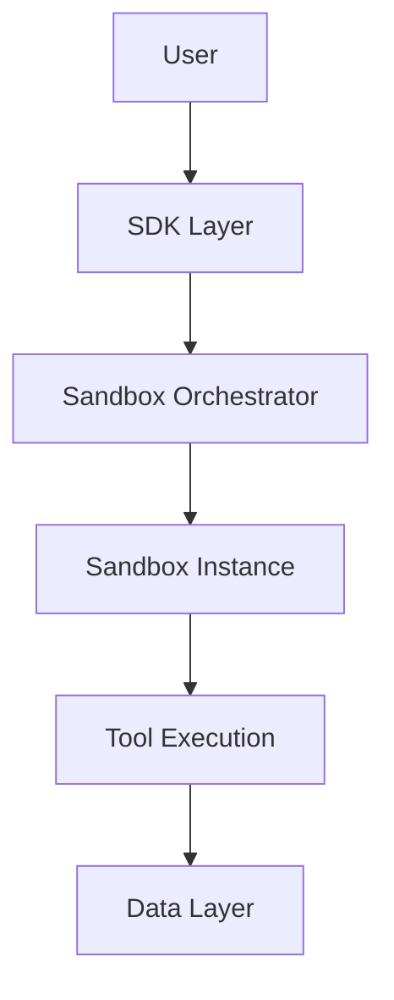

# Sandbox Toolkit Architecture

## Overview

The Sandbox Toolkit is a Python package designed to provide isolated container environments (sandboxes) for executing user-specified actions through tools. This document outlines the system architecture, component interactions, and key design decisions.

## System Components

### 1. SDK Layer
- **Purpose**: Provides the main user interface for interacting with the sandbox system
- **Key Components**:
  - `SandboxClient`: Main client class for sandbox operations
  - `ToolRegistry`: Manages tool registration and discovery
  - `ConfigManager`: Handles configuration and environment settings

### 2. Sandbox Orchestrator
- **Purpose**: Manages sandbox lifecycle and execution
- **Components**:
  - `SandboxManager`: Creates, monitors, and destroys sandbox instances
  - `ResourceController`: Handles resource allocation and limits
  - `StateManager`: Maintains sandbox state information

### 3. Tool System
- **Purpose**: Defines and executes tools within sandboxes
- **Components**:
  - `ToolBase`: Base class for all tools
  - `ToolExecutor`: Handles tool execution and result management
  - `ToolValidator`: Validates tool configurations and inputs

### 4. Data Layer
- **Purpose**: Manages persistent storage and data access
- **Components**:
  - `Qdrant`: Vector database for semantic search
  - `Neo4j`: Graph database for relationship management
  - `StateStore`: Persistent storage for sandbox state

## Component Interactions

### Control Flow
1. User interacts with SDK Layer
2. SDK Layer validates requests and forwards to Orchestrator
3. Orchestrator manages sandbox lifecycle
4. Tools execute within sandboxes
5. Results flow back through the same path

## Design Decisions

### 1. Isolation Strategy
- **Decision**: Use container-based isolation
- **Rationale**:
  - Provides strong security boundaries
  - Enables resource control
  - Allows for clean environment management

### 2. Tool Architecture
- **Decision**: Plugin-based tool system
- **Rationale**:
  - Enables easy extension
  - Maintains separation of concerns
  - Simplifies testing and maintenance

### 3. Database Choices
- **Qdrant**:
  - Efficient vector search capabilities
  - Scalable for large datasets
- **Neo4j**:
  - Natural representation of relationships
  - Powerful query capabilities

## Security Considerations

### Sandbox Isolation
- Container-level isolation
- Resource limits and quotas
- Network access controls

### Authentication and Authorization
- Role-based access control
- API key management
- Audit logging

## Error Handling

### Strategy
- Hierarchical error types
- Graceful degradation
- Detailed error reporting

### Recovery Mechanisms
- Automatic retry for transient failures
- State recovery procedures
- Resource cleanup

## Deployment and Scaling

### Infrastructure Requirements
- Container runtime (Docker/Podman)
- Database services
- Message queue (optional)

### Scaling Considerations
- Horizontal scaling of sandbox instances
- Database sharding strategies
- Load balancing approaches

## Development Guidelines

### Code Organization
- Modular architecture
- Clear separation of concerns
- Comprehensive testing

### Best Practices
- Type hints throughout
- Comprehensive documentation
- Automated testing
- CI/CD integration

## Future Considerations

### Planned Enhancements
- Distributed execution support
- Additional tool types
- Enhanced monitoring and metrics
- Advanced security features

### Extensibility Points
- Custom tool development
- Storage backend plugins
- Authentication providers
- Resource controllers

## Monitoring and Observability

### Metrics
- Sandbox lifecycle events
- Resource utilization
- Tool execution statistics

### Logging
- Structured logging
- Audit trails
- Performance monitoring

## Conclusion

The Sandbox Toolkit architecture is designed for flexibility, security, and scalability. The modular design allows for future extensions while maintaining robust isolation and resource management capabilities.